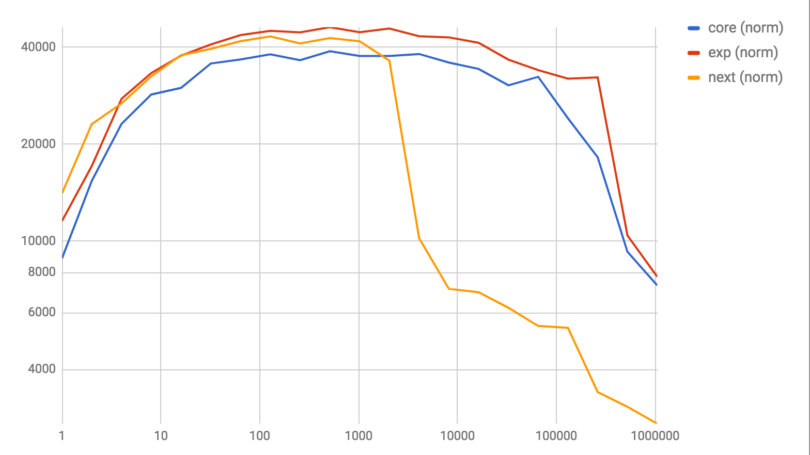

# Fast `List.foldr` and `List.map` implementations.

## `List.foldr`


_higher is better_

## `List.map`


_higher is better_

## What?

Both charts show a normalized view of how many cons-cells were processed per second by the relevant implementation, on a logarithmic scale - both vertically and horizontally.

The implementations are as follows
- `core` corresponds to the current 0.18 core implementation
- `next` corresponds to what's currently pending for 0.19
- `experiment` corresponds to this repository

The idea is applied directly to `List.map` as well, rather than implementing it in terms of `foldr`. This should at least partially explain the discrepancy there.

**Note**: the `next` implementation drops off at the 2000-elements mark, as that's the point where it falls back to a naive, stack-safe implementation.

## How?

A first realization:

`List.map` over a `List` of a known length is (which is more or less the same thing as a tuple) is easy: we just unroll the whole thing and apply the mapping function to each entry:

For example, let's assume we're only dealing with tuples of 3 entries.

```elm
map : (a -> b) -> (a, a, a) -> List b
map op ( a, b, c ) =
  op a :: op b :: op c :: []
```

Now, our list doesn't look like that, but we can create a pair of functions to first split our list into such chunks, and then `map` each such chunk, building up the final result.

More importantly, we can write this in a way that both functions can have tail calls eliminated.

_Note: We're completely ignore what happens if our list doesn't happen to exist of a `X•N` entries, with `N` the number of entries each tuple holds. This is just for illustration._

```elm
makeChunksAndMap : (a -> b) -> List a -> List (a, a, a) -> List b
makeChunksAndMap op list acc =
    case list of
        a :: b :: c :: xs ->
            makeChunks op xs (( a, b, c ) :: acc)

        _ ->
            mapChunks op acc []

mapChunks : (a -> b) -> List (a, a, a) -> List b -> List b
mapChunks op chunkList acc =
    case chunkList of
        ( a, b, c ) :: xs ->
            mapChunks op xs ( op a :: op b :: op c :: acc )

        _ ->
            acc
```

Note that it's pretty trivial to make this work properly for lists of length that doesn't happen to be a multiple of `N` by passing in the remaining N-1 elements with `op` already applied as the accumulator for `mapChunks`.

Now, _why_ would this be fast to begin with? Essentially we're minimizing the number of full traversals we need. With `N = 1`, the described pattern would essentially be reversing the list and doing a `foldl` over it, which needs 2 full traversals and needs to consider each element separately.

However, for `N = 2`, this already halves the number of full traversals we need to do, at the cost of more pattern matching. Note that the time complexity for both is the same - we're still going `O(2n)` - _however_ the constant factors involved are quite different. Function calls are very expensive, while pattern matching is relatively cheap.

So, the challenge is finding an `N` that provides a good balance between the cost of the required pattern-matching, and the savings by limiting the number of full traversals we need.

Additionally, a higher `N` means more code.

**However** there is a second, more hidden cost: we're allocating a bunch of extra datastructures - those tuples each take up some memory, and we're holding `n // N` of these in memory. The actual act of constructing a tuple _also_ comes at a cost!

So here's a second realization: we can keep the tails of the list in memory, and pattern match on those in `mapChunks`. Since we've already proven that each tail holds the appropriate number of elements, this means we only pay the cost of pattern-matching twice. Since lists are a nested datastructure, holding on to a "subtree" of that costs no more than a single pointer.

Consider an input list like so:

```
a :: b :: c :: d :: e :: f :: g :: h :: i :: j :: []
```

We can represent the tails with pointers to these elements, for `N = 3`

```
a :: b :: c :: d :: e :: f :: g :: h :: i :: j :: []
^---------------------------------------------------
               ^------------------------------------
                              ^---------------------
                                             ^------
```

With tuples, for a list of length X, we keep a list of `X // N` tuples in memory, each with `N` pointers to the contained data. So essentially, we're duplicating the entire list in memory while chunking, with some added overhead to actually construct tuples.

With tails, we keep just `X // N` tails in memory, each a single pointer to a specific tail.

Using that strategy, the challenge changes a little, since the impact of pattern-matching is now paid _twice_.

## Credits

Based on https://twitter.com/antron__/status/910894281593942017

## Running the benchmarks

- Go into `bench`
- run `./run.sh MapBench.elm` to compare `map` performance
- run `./run.sh FoldrBench.elm` to compare `foldr` performance
- run `./run.sh MapDepth.elm` to compare performance for how deep we pattern match things

Fair warning: these take a while.

## TODO

- [x] how deep to unroll

  -> [performance of different N](charts/depth.png)
  -> [performance for foldr](charts/foldrdepth.png)

  As long as it's over 3, things start to matter less. 4 is still struggling a little, 5 seems great, 6 and up seem somewhat less stable.

- [x] impact of manually unrolling vs multiple patterns
  - [x] performance impact

    -> [performance of flat vs unrolled](charts/flatvsunrolled.png)

  - [x] code-size impact

    -> So since every pattern is an extension of the previous pattern, the compiler is being super-nice and generating very compact code. As a matter of fact, manually unrolling leads to _more_ code. However, after minifying through uglifyJS, the relevant code for `List.map` is 1111 characters for the "flat" version, and 1064 for the "nested" version. A marginal saving, but a saving nonetheless.

- [ ] impact of tuples vs pattern-matches

  -> [performance of tails vs tuples for map](charts/tailtuplesmapperf.png)
  -> [performance of tails vs tuples for foldr](charts/tailstuplesfoldrperf.png)

- [x] cross-browser tests
  - [chrome](charts/chrome-map.png)
  - [firefox 57](charts/ff57-map.png)
  - [firefox stable](charts/ffstable-map.png)
  - [IE11](charts/ie11-map.png)
  - [IE15/edge](charts/ie15-map.png)
  - [node](charts/node-map.png)
  - [safari](charts/safari-map.png)
