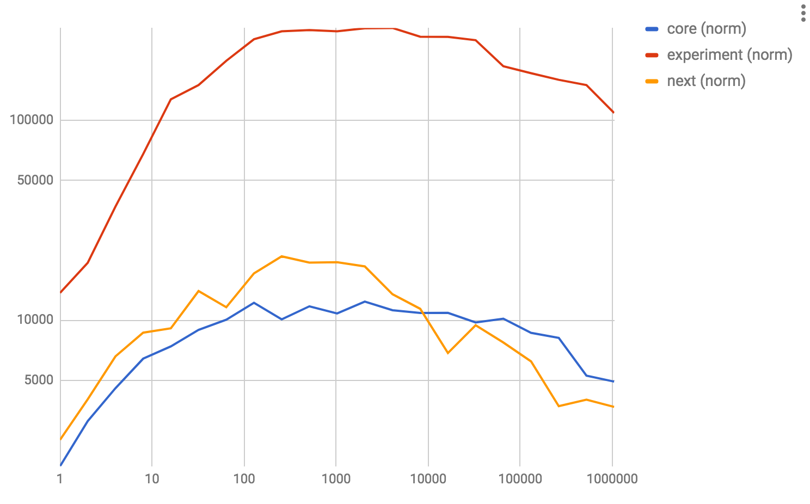

# Fast `List.foldr` and `List.map` implementations.

## `List.foldr`

*todo*

## `List.map`



## What?

Both charts show a normalized view of how many cons-cells were processed per second by the relevant implementation, on a logarithmic scale - both vertically and horizontally.

The implementations are as follows
- `core` corresponds to the current 0.18 core implementation
- `next` corresponds to what's currently pending for 0.19
- `experiment` corresponds to this repository

The idea is applied directly to `List.map` as well, rather than implementing it in terms of `foldr`. This should at least partially explain the discrepancy there.

## How?

Say our list looks like this:

```
a :: b :: c :: d :: e :: f :: g :: h :: i :: j :: []
```

The realization is that we can create a reversed list of tails, where the entry point is X cells from the previous, with very little memory overhead. Rather than storing only a certain chunk, we store the entire tail.

For example, with X = 4:
```
a :: b :: c :: d :: e :: f :: g :: h :: i :: j :: []
|---------------------------------------------------
                    |-------------------------------
                                        |-----------
```

By consing that entire tail to an accumulator of chunks, we efficiently build a bunch of chunks. We can then do a second recursive loop over that accumulator, taking only the relevant X entries from each tail, discarding the rest, and using those to build out final accumulator.

Both these loops can be implemented in a tail-recursive manner, and both are fairly memory efficient.

## Credits

Based on https://twitter.com/antron__/status/910894281593942017
